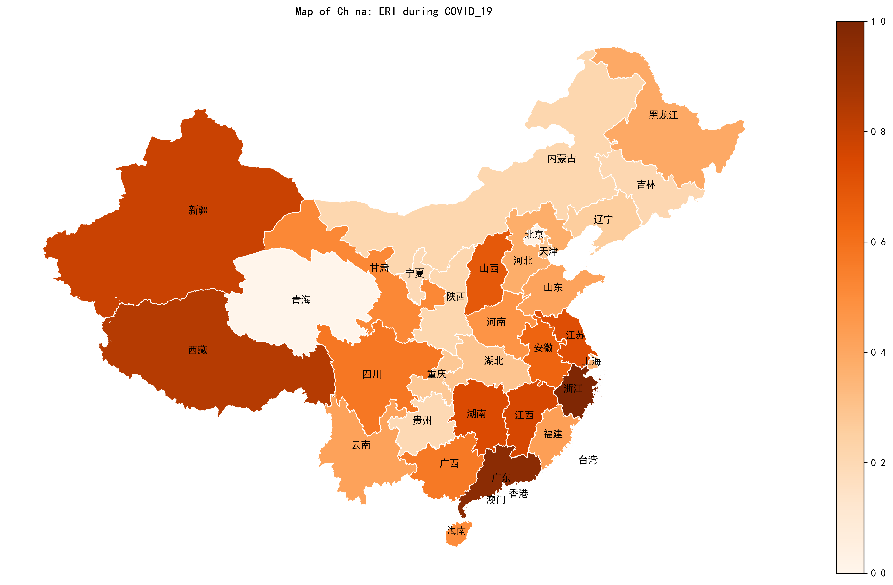
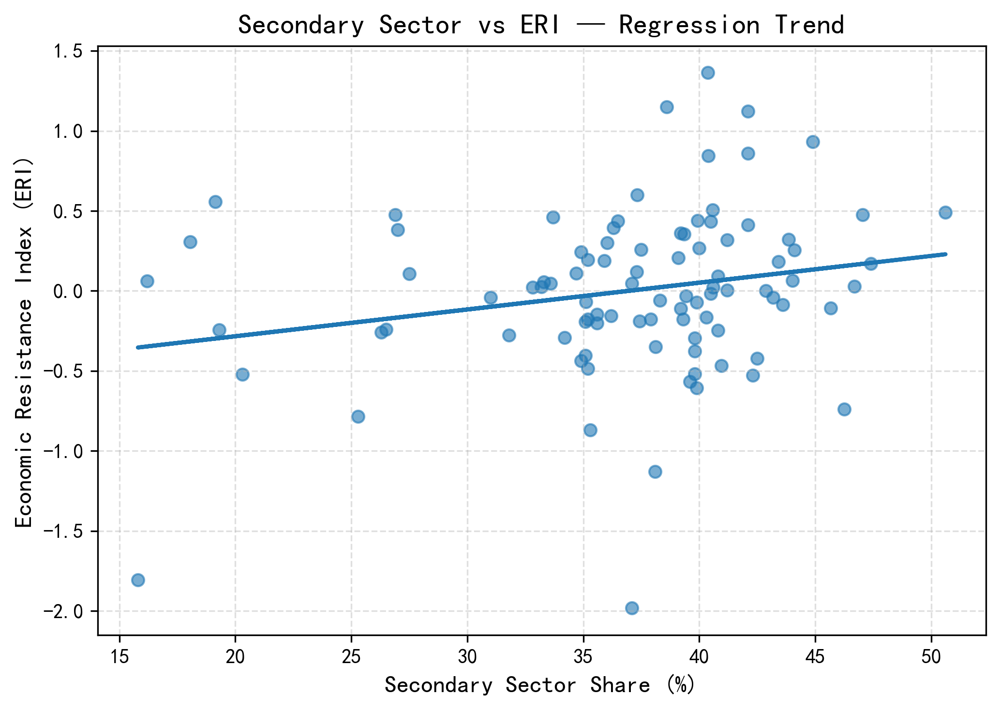

# 经济韧性指数（ERI）：中国在新冠疫情期间的区域分析

点击 [这里](README.md) 查看英文文档.      

## 项目概述

本项目构建了一个 **经济韧性指数（Economic Resilience Index, ERI）**，用于衡量中国各省份在新冠疫情期间应对经济冲击和恢复能力的差异。

该指数通过整合多个经过标准化处理的宏观经济指标，形成一个综合评分，从而实现：

* 对各省经济韧性的量化评估
* 不同地区之间的横向比较
* 对区域经济表现的空间与统计分析

---

## 方法论

### 1. 数据处理

项目使用省级宏观经济数据，对原始数据进行清洗和整理。所选指标从不同角度反映地区在疫情冲击下的经济稳定性与恢复能力。

### 2. 指标标准化（Z-score）

为消除量纲和规模差异，所有指标均采用 **Z-score 标准化方法**：

> Z = (x − μ) / σ

该方法使不同指标具有可比性，为后续综合指数的构建奠定基础。

### 3. 综合指数构建

将标准化后的各项指标进行聚合，得到经济韧性指数（ERI）：

* ERI 值越高，表示地区经济韧性越强
* ERI 值越低，表示地区在冲击下更为脆弱

### 4. 趋势与分布分析

通过统计分析方法：

* 观察 ERI 在省际之间的分布特征
* 识别异常值与区域差异
* 分析整体趋势及潜在结构性特征

---

## 可视化结果

### 🗺️ 经济韧性空间分布图

该地图展示了新冠疫情期间中国各省经济韧性的空间分布情况。

* 颜色越深，表示经济韧性越强
* 颜色越浅，表示经济韧性越弱

---

### 📊 ERI 分布与趋势分析

以下图表展示了经济韧性指数的统计特征。

---

## 主要结论

* 经济结构多元化程度较高的省份通常表现出更强的经济韧性
* 产业结构单一或发展水平较低的地区在疫情冲击下面临更大压力
* 部分西部地区表现出相对稳定的经济韧性，说明其韧性来源并非完全由传统发展水平决定

---

## 使用技术

* Python
* Pandas / NumPy
* Matplotlib
* GeoPandas
* Jupyter Notebook

---

## 项目目的

本项目为学术与分析性质项目，主要展示：

* 区域经济分析能力
* 数据标准化与指数构建方法
* 经济数据的可视化与解释能力

该框架可进一步扩展至跨国比较、政策分析或更深入的计量经济研究。

---

## 说明

所有图表与地图均通过程序自动生成。README 中的路径基于上述项目结构。
